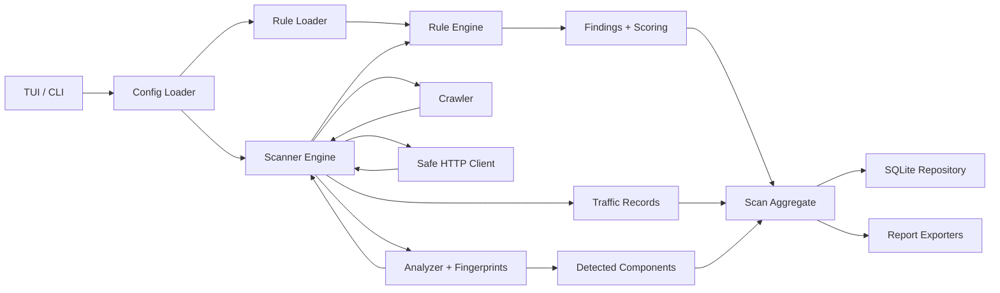
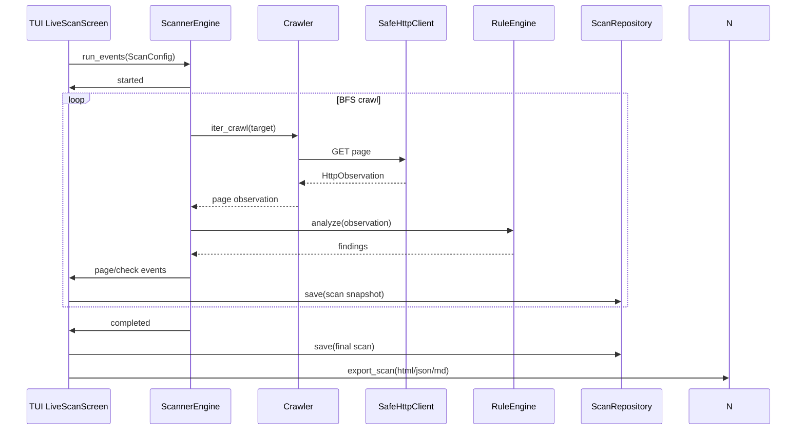
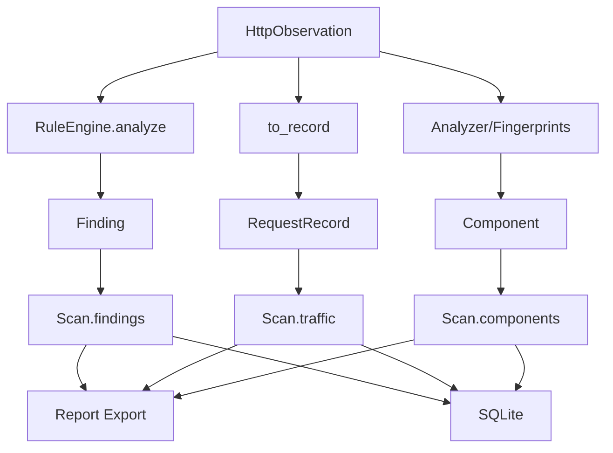

# Architecture

VulnScope is built as a modular offline-first pipeline with safe scanning and TUI-driven control.

## High-Level Pipeline

## Runtime Sequence

## Module Responsibilities

### Entry Points
- `src/vulnscope/cli.py`: Typer CLI (`scan`, `doctor`, `update`, `serve`, `import`, `profiles ...`).
- `src/vulnscope/app.py`: public launcher `run_tui`.
- `src/vulnscope/__main__.py`: package module entry point.

### Configuration
- `src/vulnscope/config.py`:
	- pydantic models `Settings`, `ScannerSettings`, `RuleSettings`, `ExportSettings`, `ScanProfileSettings`.
	- config discovery by precedence.
  - env overrides (`VULNSCOPE_CONFIG`, `VULNSCOPE_DATABASE_PATH`, `VULNSCOPE_REPORT_DIR`, `VULNSCOPE_RATE_LIMIT`).
	- persistence of editable settings in YAML.

### Domain
- `src/vulnscope/domain/models.py`: models `ScanConfig`, `Scan`, `Finding`, `RequestRecord`, `Component`, `Target`.
- `src/vulnscope/domain/enums.py`: `Severity`, `ScopeMode`, scan profiles.
- `src/vulnscope/domain/scoring.py`: deterministic risk-scoring $0..10$.

### Scanner
- `src/vulnscope/scanner/engine.py`: orchestration scan lifecycle + `ScanEvent` (`started`, `page`, `check`, `completed`), pause/resume/stop.
- `src/vulnscope/scanner/crawler.py`: BFS crawl, link/form extraction, seed endpoints.
- `src/vulnscope/scanner/http_client.py`: safe HTTP client (`httpx`, timeout, TLS verify, secret redaction in previews).
- `src/vulnscope/scanner/scope.py`: same-host / same-domain / custom include/exclude.
- `src/vulnscope/scanner/payloads.py`: safe payload catalog by profile.
- `src/vulnscope/scanner/analyzer.py`: component detection (headers/meta/assets).
- `src/vulnscope/scanner/fingerprints.py`: loading fingerprint rules from YAML.
- `src/vulnscope/scanner/profiles.py`: profile application and persistence helpers.

### Rules
- `src/vulnscope/rules/schema.py`: typed YAML rule schema and match types.
- `src/vulnscope/rules/matchers.py`: runtime matching over body/headers/status/size delta.
- `src/vulnscope/rules/engine.py`: transform match -> `Finding` + scoring.
- `src/vulnscope/rules/loader.py`: local + remote feed loading, validation, and deduplication.
- `src/vulnscope/rules/feed.py`: feed index build/fetch, hash-based cache.
- `src/vulnscope/rules/server.py`: local HTTP feed server for rule development.

### Storage
- `src/vulnscope/storage/database.py`: SQLAlchemy schema (`scans`, `findings`, `traffic`, `components`, `settings`, `custom_rules`).
- `src/vulnscope/storage/repositories.py`: `ScanRepository` save/list/get, secret redaction before persistence.

### Reports
- `src/vulnscope/reports/exporters.py`: facade `export_scan(fmt=html|json|markdown)`.
- `src/vulnscope/reports/html.py`: Jinja2 exporter.
- `src/vulnscope/reports/json.py`: structured JSON export with secret redaction.
- `src/vulnscope/reports/markdown.py`: human-readable markdown export.

### TUI
- `src/vulnscope/tui/main.py`: `VulnScopeApp`, global bindings, navigation.
- `src/vulnscope/tui/screens.py`: Dashboard, New Scan, Live Scan, Scan Detail, Settings, Help, detail modals.
- `src/vulnscope/tui/controllers.py`: bridge between UI and services.
- `src/vulnscope/tui/widgets.py`: reusable widgets.
- `src/vulnscope/tui/styles.tcss`: UI theme and layout.

## Safety Boundaries

- The scanner performs only safe GET-based checks and does not perform post-exploitation.
- Default scope policy limits scanning to the original host.
- Payload checks are restricted to a small safe catalog and rate limiting.
- Network errors are converted into observations (no hard scan crash).

## Data Model Flow

