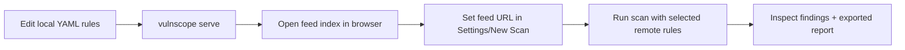

# Development

## Setup

```bash
python -m venv .venv
.\.venv\Scripts\Activate.ps1
pip install -e ".[dev]"
```

## Local Run Modes

- `vulnscope`: launch the TUI.
- `vulnscope scan https://target`: open TUI with a prefilled target.
- `vulnscope doctor`: runtime/SQLite/rules/report directory health check.
- `vulnscope update`: validate local and remote rules.
- `vulnscope serve --path ./rules --ip 127.0.0.1 --port 8080`: run a local feed server.

## Codebase Layout

- `src/vulnscope/scanner`: crawl + payload checks + scope + HTTP client.
- `src/vulnscope/rules`: schema/loader/matchers/engine/feed/server.
- `src/vulnscope/storage`: SQLAlchemy schema + repositories.
- `src/vulnscope/reports`: html/json/markdown exporters.
- `src/vulnscope/tui`: screens, controllers, styles, and bindings.
- `tests/`: unit/functional tests for config, scope, crawler, scoring, rules, and reports.

## Add New YAML Rule

1. Choose a registry, for example `rules/web/<category>.yaml`.
2. Define the rule according to `docs/rules.md` and `src/vulnscope/rules/schema.py`.
3. Ensure the `id` is unique across all loaded rules.
4. Run `vulnscope update` and verify the rule validates and loads.
5. Run tests and a manual scan on a safe test target.

## Add New Registry

1. Create a `rules/<registry>/` directory.
2. Add rule YAML files.
3. If technology signatures are needed, add fingerprint files under `rules/fingerprints`.
4. Add profile/filtering support in UI and smoke tests when needed.

## Remote Feed Development Workflow



Recommended integration testing practice:
- keep `vulnscope serve` running on a test port;
- set the feed URL in a scan profile (`profiles.<name>.remote_feeds`);
- verify cache behavior in `~/.vulnscope/cache/remote-feeds` (or custom path).

## Extend Scanner Module

1. Add behavior in `scanner/*` (for example, new observations or safe probes).
2. Update `ScanConfig`/models only when required.
3. Ensure safety boundaries remain intact (no brute force, no destructive actions).
4. Add/update tests in `tests/`.

## Extend Reporting

1. Add a domain field (`Finding`/`Scan`) only if it is truly needed by multiple exporters.
2. Extend the corresponding exporter in `src/vulnscope/reports/*`.
3. Keep report format compatibility (especially JSON fields).
4. Verify TUI export behavior has no regressions.

## Database / Storage Changes

1. Update SQLAlchemy row models in `storage/database.py`.
2. Synchronize conversions in `storage/repositories.py`.
3. Run the flow: new scan -> save -> list/get -> export.

## Recommended Validation Loop

1. `vulnscope doctor`
2. `vulnscope update`
3. `pytest`
4. Manual TUI flow: New Scan -> Live Scan -> Scan Detail -> Export

## CI / CD Examples

See `examples/github-actions-vulnscope.yml` for a minimal GitHub Actions example that installs the `vulnscope` CLI and runs a scan as part of CI. Use this as a starting point to integrate vulnerability checking into your project's pipeline.

Examples are provided in the `examples/` directory.
