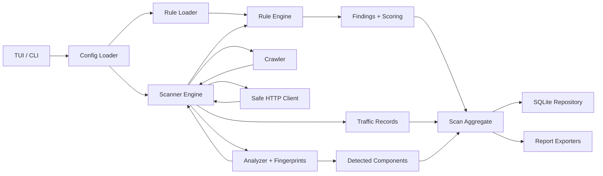
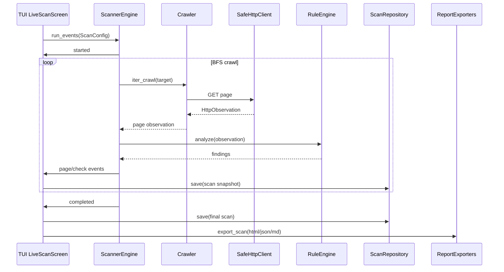
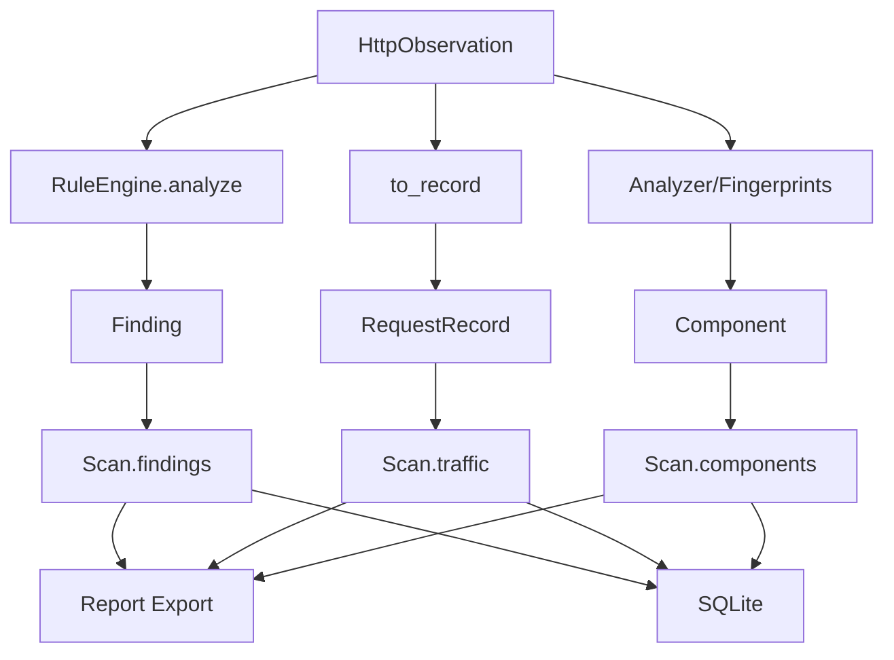

# Architecture

VulnScope is built as a modular offline-first pipeline with safe scanning and TUI-driven control.

## High-Level Pipeline

## Runtime Sequence

## Module Responsibilities

### User Interfaces
Interactive command-line interface (CLI) and a text-based user interface (TUI) provide entry points for users to start and control scans, manage profiles and settings, view live progress and interactively inspect findings. Interfaces support both interactive use and headless automation for CI pipelines.

### Configuration and Profiles
Layered, environment-aware configuration enables persistent settings and editable scan profiles. Profiles capture scanning scope, payload sets and operational limits to ensure reproducible runs and easy profile switching.

### Scan Orchestration
The scan orchestrator manages scan lifecycle events (start, per-page checks, findings, completion), supports pause/resume/stop semantics, and coordinates a breadth-first crawl with seed handling and scoped traversal rules to control discovery behavior.

### Safe HTTP Observation
A resilient observation layer captures requests and responses with timeouts, TLS verification and error handling, while normalizing observations and applying secret redaction to sensitive fields before any downstream processing.

### Scope and Safety Enforcement
Configurable scope policies and operational safeguards (rate limiting, read-only defaults, safe payload catalogs) minimize risk to scanned targets. Scope enforcement ensures traversal remains within intended boundaries.

### Rule Evaluation
Declarative rule processing evaluates response bodies, headers, status codes and deltas against a ruleset. The engine supports feed ingestion, rule versioning, deduplication and deterministic matching semantics.

### Component Fingerprinting
Fingerprinting identifies libraries, frameworks and server components by analyzing headers, resource patterns and page artifacts, producing structured component observations for inventory and correlation with findings.

### Findings and Scoring
Rule matches are converted into findings with contextual metadata. A deterministic scoring mechanism assigns risk levels and aggregations prioritize issues for triage and reporting.

### Persistence and Reproducibility
Local persistence stores scan runs, traffic records, findings and detected components. Snapshots and audit records enable diffs, re-analysis and reproducible investigation of historical scans.

### Reporting and Export
Export capabilities produce stakeholder-ready outputs (HTML, JSON, Markdown) with secret redaction and navigable summaries. Exporters format findings, traffic overview and component inventories for consumption.

### Observability and Audit Trail
The system emits event streams and logs for the scan lifecycle and retains snapshots of requests/responses to support debugging, post-mortem analysis and compliance auditing.

### Extensibility
Extension points allow custom rules, external feeds and additional fingerprint sources to be integrated, enabling users to extend detection coverage and incorporate domain-specific knowledge.

Responsibilities are organized into distinct layers—interface, scanning/observation, rule evaluation, analysis/scoring, storage and export—to preserve safety, testability and extensibility.

## Safety Boundaries

- The scanner performs only safe GET-based checks and does not perform post-exploitation.
- Default scope policy limits scanning to the original host.
- Payload checks are restricted to a small safe catalog and rate limiting.
- Network errors are converted into observations (no hard scan crash).

## Data Model Flow

