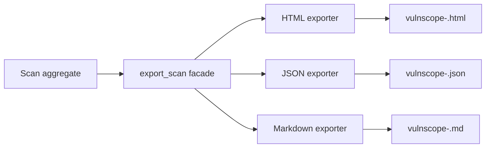

# Reports

Reports can be exported as HTML, JSON, or Markdown.

## Export Pipeline



Export facade: `src/vulnscope/reports/exporters.py`.

## HTML Report

- Template-based (`Jinja2`) rendering.
- Findings are sorted by `risk_score` (desc).
- Includes summary, finding cards/table, evidence, recommendations, and components.
- Themes: `dark`, `light`, `academic`.

## JSON Report

- Full structured `Scan` snapshot plus top-level `summary`.
- Secrets in `request`/`response` are redacted.
- `response` in findings is truncated to the first 1000 chars by default.
- Pretty printing is controlled by `export.json_pretty`.

Top-level example:

```json
{
	"summary": {
		"critical": 0,
		"high": 1,
		"medium": 2,
		"low": 3,
		"info": 4,
		"total": 10
	},
	"id": "...",
	"target": "https://example.local",
	"profile": "safe",
	"status": "completed",
	"findings": [],
	"traffic": [],
	"components": [],
	"metadata": {}
}
```

## Markdown Report

- Human-readable format for manual auditing and notes.
- Sections: Scan metadata -> Summary -> Findings -> Components.
- For each finding: severity, confidence, risk score, URL, parameter, rule id, evidence, recommendation.

## File Naming And Location

- File name: `vulnscope-<scan_id>.<ext>`.
- Directory: `export.report_dir` (or override via `VULNSCOPE_REPORT_DIR`).
- Export is available from:
  - Live Scan after completion/stop.
  - Scan Detail for persisted scans.

## Data Hygiene

- Potential secrets are redacted both before DB persistence and during export.
- JSON/Markdown are intended for CI and handoff, HTML for visual analysis.
