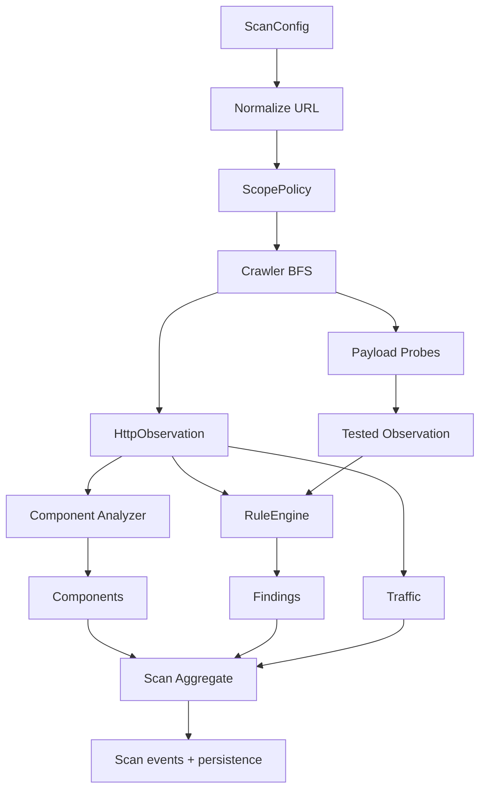

# Scanner

The scanner normalizes targets, enforces same-host or same-domain scope, crawls pages breadth-first, collects links and forms, identifies GET parameters, sends only safe payload probes, and emits events for the TUI.

Profiles tune request volume and check types. Safe Scan is the default. The scanner does not brute force, delete data, execute commands, or attempt post-detection exploitation.

## Scanner Runtime Flow

## Safety And Scope

- Only `http/https` targets are supported.
- Scope policy:
	- `same_host` (default): only the same host.
	- `same_domain`: the same registrable domain.
	- `custom`: include/exclude glob patterns.
- The crawler ignores out-of-scope URLs.
- Checks do not perform destructive actions.

## Crawl Behavior

- Strategy: breadth-first search (BFS).
- Limits: `max_depth`, `max_pages`.
- URL sources:
	- starting target,
	- seed endpoints (for example `/robots.txt`, `/api`, `/graphql`),
	- HTML links/assets/forms,
	- simple endpoint strings from inline JavaScript.
- Error responses (>=400) do not expand the link graph further.

## Payload Probing

- Payload checks are executed only for GET parameters and GET forms.
- If no query parameters exist, a common probe parameter set is used (for example `q`, `search`, `redirect`, `file`).
- Baseline fields are saved per check (`baseline_status_code`, `baseline_size`).
- Rate limiting applies: pause of $1 / rate\_limit$ seconds between checks.

## Profiles

Supported profiles (`domain.enums.ScanProfile`):

- `quick`
- `safe`
- `owasp_top_10`
- `headers`
- `dependency`
- `deep`
- `authenticated`

Effective payload sets depend on profile:
- `headers`, `dependency`: payload checks disabled.
- `quick`: minimal subset.
- `deep`: expanded subset (xss/sqli/path/redirect).
- `safe` and `owasp_top_10`: balanced subsets.

## Scan Events (for TUI)

`ScannerEngine.run_events` emits events:

- `started`: scan started.
- `page`: crawler page processed.
- `check`: payload probe processed.
- `completed`: final status.

Each event contains the current `scan` snapshot.

## Pause/Resume/Stop

- `pause()`: temporarily pauses progress without losing state.
- `resume()`: resumes the scan loop.
- `stop()`: gracefully stops a scan with status `stopped`.

## Component Detection

Component sources:
- HTTP headers (`Server`, `X-Powered-By`).
- HTML (`meta generator`, title heuristics).
- JS assets (library patterns).
- YAML fingerprints (`rules/fingerprints/*`).

Results are deduplicated by `(name, version, source)`.

## Finding Deduplication

During scan execution, duplicate findings are filtered by key:
- source,
- rule_id/title,
- URL (without query for most categories),
- parameter,
- payload,
- evidence fragment.

This reduces noise and duplicates in reports and TUI.

