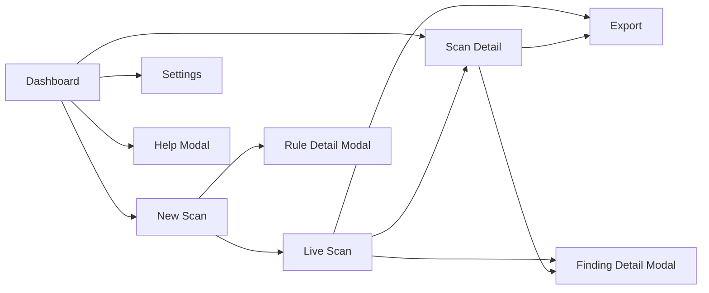
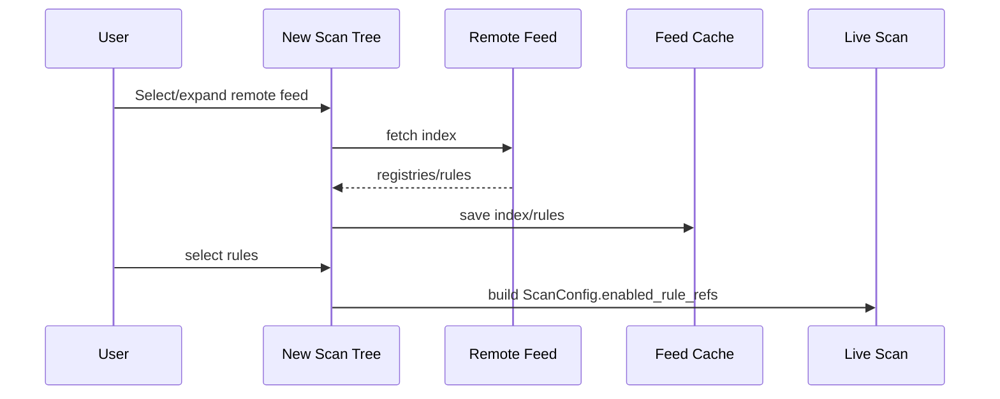

# TUI

The Textual interface includes Dashboard, New Scan, Live Scan, Scan Detail, and Settings.

Rule feed workflow in UI:
- add remote feed URLs in settings,
- configure per-scan rule selections in New Scan `Selected Rules` tab,
- inspect rule descriptions from the rules tree context action,
- remote feeds load on demand and use the remote feed cache.

## Screen Map

## Global Navigation

Main bindings:

- `q`: Quit
- `d`: Dashboard
- `n`: New Scan
- `s`: Settings
- `?`: Help

Shortcut metadata also includes: `f`, `r`, `/`, `e` (used for help/UX hints).

## Dashboard

- Shows recent scans from SQLite.
- Table columns: `ID`, `Target`, `Profile`, `Status`, `Findings`.
- Auto-refreshes the list.
- Navigation: New Scan, Settings, Scan Detail.

## New Scan

Tabs:
- `Target`: URL + profile.
- `Settings`: `rate_limit`, `max_depth`, `max_pages`.
- `Selected Rules`: local and remote rule tree.

Features:
- on-demand remote feed loading (on selection/expand),
- checkboxes at group/source/registry/category/rule levels,
- context action to open Rule details,
- save and delete scan profiles.

## Live Scan

- Starts scan runtime and subscribes to `ScanEvent`.
- Progress and current URL are updated from events.
- Findings table supports per-column sorting.
- Runtime controls: `Pause`, `Resume`, `Stop`.
- HTML/JSON/Markdown exports become available after completion.

## Scan Detail

- Tabs:
  - `Findings`: findings table.
  - `Scan Settings`: persisted `metadata.config`.
- Export is available for final statuses (`completed|stopped`).
- Opens a detail modal per finding.

## Settings

Tabs:
- `General`: DB path, report dir, export format, HTML theme.
- `Scanner`: default limits.
- `Rules`: rule paths, remote cache dir, remote feeds.

Saving settings writes `vulnscope.yaml` and refreshes controller state.

## Controller And Persistence

- `AppController` isolates screens from storage/config logic.
- Live scan saves snapshots to DB on start, traffic changes, and completion.
- Dashboard and Scan Detail read data through `ScanRepository`.

## Remote Feed UX

## Error Handling

- Feed loading errors are shown via `notify(..., severity="error")`.
- Invalid numeric fields in Settings/New Scan block save/start with a warning.
- If a scan is missing, Scan Detail exits safely back to the previous screen.
