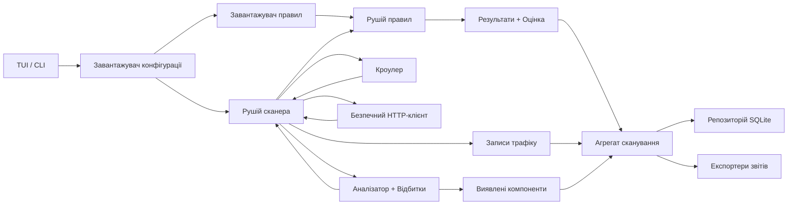
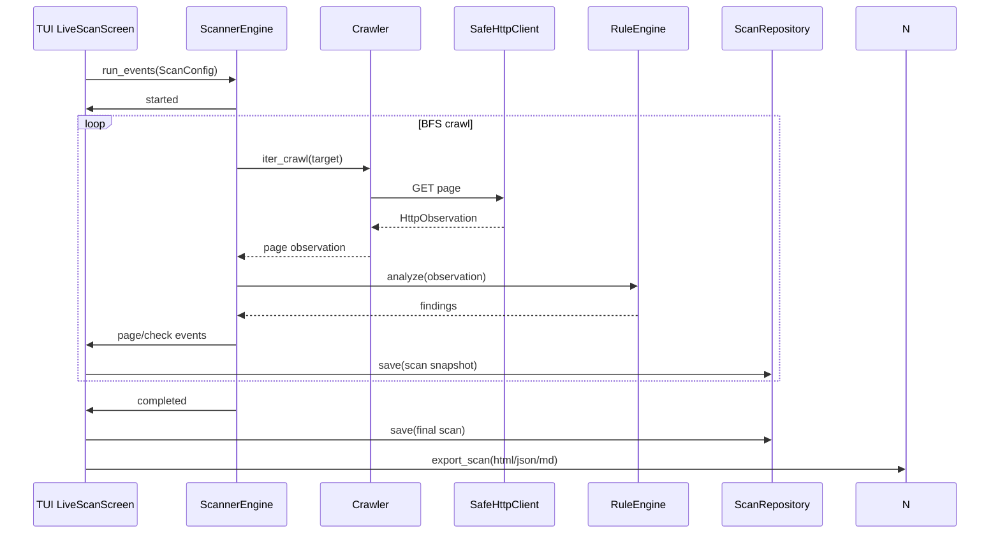

# Архітектура

VulnScope побудований як модульний конвеєр, що працює за принципом offline-first, із безпечним скануванням та керуванням через TUI.

## Конвеєр високого рівня

## Послідовність виконання

## Відповідальність модулів

### Користувацькі інтерфейси
Інтерактивний інтерфейс командного рядка (CLI) та текстовий інтерфейс користувача (TUI) забезпечують точки входу для користувачів, щоб запускати та керувати скануванням, керувати профілями та налаштуваннями, переглядати прогрес у реальному часі та інтерактивно переглядати результати. Інтерфейси підтримують як інтерактивне використання, так і безголову (headless) автоматизацію для CI-конвеєрів.

### Конфігурація та профілі
Багатошарова конфігурація з урахуванням середовища дозволяє зберігати налаштування та редагувати профілі сканування. Профілі фіксують область сканування, набори корисного навантаження та операційні ліміти для забезпечення відтворюваності запусків та легкого перемикання профілів.

### Оркестрація сканування
Оркестратор сканування керує подіями життєвого циклу сканування (старт, перевірки кожної сторінки, результати, завершення), підтримує семантику паузи/відновлення/зупинки та координує пошук у ширину (BFS) з обробкою початкових точок та правилами обмеженого обходу для контролю поведінки виявлення.

### Безпечне HTTP-спостереження
Стійкий шар спостереження фіксує запити та відповіді з таймаутами, перевіркою TLS та обробкою помилок, нормалізуючи спостереження та застосовуючи редагування секретів у чутливих полях перед будь-якою подальшою обробкою.

### Виконання області дії та безпеки
Налаштовувані політики області дії та операційні запобіжники (обмеження швидкості, читання за замовчуванням, безпечні каталоги корисного навантаження) мінімізують ризик для цілей сканування. Виконання області дії гарантує, що обхід залишається в межах передбачених меж.

### Оцінка правил
Декларативна обробка правил оцінює тіла відповідей, заголовки, коди станів та дельти за допомогою набору правил. Рушій підтримує поглинання стрічок (feeds), версіонування правил, дедуплікацію та детерміновану семантику зіставлення.

### Відбитки компонентів
Створення відбитків ідентифікує бібліотеки, фреймворки та компоненти сервера шляхом аналізу заголовків, шаблонів ресурсів та артефактів сторінок, створюючи структуровані спостереження про компоненти для інвентаризації та кореляції з результатами.

### Результати та оцінка
Зіставлення правил перетворюються на результати з контекстними метаданими. Детермінований механізм оцінки призначає рівні ризику, а агрегація пріоритезує проблеми для сортування та звітності.

### Постійність та відтворюваність
Локальне сховище зберігає запуски сканування, записи трафіку, результати та виявлені компоненти. Знімки (snapshots) та аудиторські записи дозволяють порівнювати, повторно аналізувати та відтворювати розслідування історичних сканувань.

### Звітність та експорт
Можливості експорту створюють готові для стейкхолдерів результати (HTML, JSON, Markdown) з редагуванням секретів та навігаційними резюме. Експортери форматують результати, огляд трафіку та інвентаризацію компонентів для споживання.

### Спостережливість та аудиторський слід
Система генерує потоки подій та логи для життєвого циклу сканування та зберігає знімки запитів/відповідей для підтримки налагодження, пост-мортем аналізу та аудиту відповідності.

### Розширюваність
Точки розширення дозволяють інтегрувати користувацькі правила, зовнішні стрічки та додаткові джерела відбитків, що дозволяє користувачам розширювати охоплення виявлення та включати специфічні для домену знання.

Відповідальність організована в окремі шари — інтерфейс, сканування/спостереження, оцінка правил, аналіз/оцінка, сховище та експорт — для забезпечення безпеки, тестованості та розширюваності.

## Межі безпеки

- Сканер виконує лише безпечні перевірки на основі GET-запитів і не виконує пост-експлуатацію.