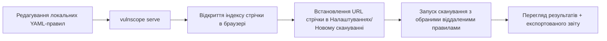

# Розробка

## Налаштування

```bash
py -3.12 -m venv .venv
.\.venv\Scripts\Activate.ps1
pip install -e ".[dev]"
```

## Локальні режими запуску

- `vulnscope`: запустити TUI.
- `vulnscope scan https://target`: відкрити TUI з попередньо заповненою ціллю.
- `vulnscope doctor`: перевірка стану середовища виконання/SQLite/правил/каталогу звітів.
- `vulnscope update`: перевірка локальних та віддалених правил.
- `vulnscope serve --path ./rules --ip 127.0.0.1 --port 8080`: запустити локальний сервер стрічок.

## Структура кодової бази

- `src/vulnscope/scanner`: обхід + перевірки корисного навантаження + область дії + HTTP-клієнт.
- `src/vulnscope/rules`: схема/завантажувач/зіставлення/рушій/стрічка/сервер.
- `src/vulnscope/storage`: схема SQLAlchemy + репозиторії.
- `src/vulnscope/reports`: експортери html/json/markdown.
- `src/vulnscope/tui`: екрани, контролери, стилі та прив'язки.
- `tests/`: модульні/функціональні тести для конфігурації, області дії, кроулера, оцінки, правил та звітів.

## Додавання нового YAML-правила

1. Оберіть реєстр, наприклад `rules/web/<category>.yaml`.
2. Визначте правило відповідно до `docs/rules.md` та `src/vulnscope/rules/schema.py`.
3. Переконайтеся, що `id` є унікальним серед усіх завантажених правил.
4. Запустіть `vulnscope update` і перевірте, що правило проходить валідацію та завантажується.
5. Запустіть тести та ручне сканування на безпечній тестовій цілі.

## Додавання нового реєстру

1. Створіть каталог `rules/<registry>/`.
2. Додайте YAML-файли правил.
3. Якщо потрібні технологічні підписи, додайте файли відбитків у `rules/fingerprints`.
4. Додайте підтримку профілів/фільтрації в UI та димові тести за потреби.

## Робочий процес розробки віддалених стрічок



Рекомендована практика інтеграційного тестування:
- тримайте `vulnscope serve` запущеним на тестовому порту;
- встановіть URL стрічки в профілі сканування (`profiles.<name>.remote_feeds`);
- перевірте поведінку кешу в `~/.vulnscope/cache/remote-feeds` (або кастомному шляху).

## Розширення модуля сканера

1. Додайте поведінку в `scanner/*` (наприклад, нові спостереження або безпечні зонди).
2. Оновіть `ScanConfig`/моделі лише за потреби.
3. Переконайтеся, що межі безпеки залишилися недоторканими (жодного брутфорсу, жодних руйнівних дій).
4. Додайте/оновіть тести в `tests/`.

## Розширення звітності

1. Додайте поле домену (`Finding`/`Scan`) лише якщо воно дійсно потрібне кільком експортерам.
2. Розширте відповідний експортер у `src/vulnscope/reports/*`.
3. Зберігайте сумісність форматів звітів (особливо полів JSON).
4. Перевірте, щоб експорт у TUI не мав регресій.

## Зміни в базі даних / сховищі

1. Оновіть моделі рядків SQLAlchemy в `storage/database.py`.
2. Синхронізуйте конвертації в `storage/repositories.py`.
3. Запустіть цикл: нове сканування -> збереження -> список/отримання -> експорт.

## Рекомендований цикл валідації

1. `vulnscope doctor`
2. `vulnscope update`
3. `pytest`
4. Ручний потік TUI: Нове сканування -> Живе сканування -> Деталі сканування -> Експорт

## Приклади CI / CD

Дивіться `examples/github-actions-vulnscope.yml` для мінімального прикладу GitHub Actions, який встановлює CLI `vulnscope` та запускає сканування як частину CI. Використовуйте це як відправну точку для інтеграції перевірки вразливостей у ваш конвеєр проекту.

Приклади надані в каталозі `examples/`.