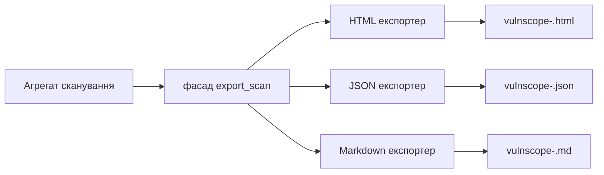

# Звіти

Звіти можуть бути експортовані у форматах HTML, JSON або Markdown.

## Конвеєр експорту



Фасад експорту: `src/vulnscope/reports/exporters.py`.

## HTML-звіт

- Рендеринг на основі шаблонів (`Jinja2`).
- Результати відсортовані за `risk_score` (спадання).
- Включає резюме, картки/таблицю результатів, докази, рекомендації та компоненти.
- Теми: `dark`, `light`, `academic`.

## JSON-звіт

- Повний структурований знімок `Scan` плюс резюме верхнього рівня `summary`.
- Секрети в `request`/`response` видаляються (redacted).
- `response` у результатах за замовчуванням обрізається до перших 1000 символів.
- Гарний друк керується параметром `export.json_pretty`.

Приклад верхнього рівня:

```json
{
	"summary": {
		"critical": 0,
		"high": 1,
		"medium": 2,
		"low": 3,
		"info": 4,
		"total": 10
	},
	"id": "...",
	"target": "https://example.local",
	"profile": "safe",
	"status": "completed",
	"findings": [],
	"traffic": [],
	"components": [],
	"metadata": {}
}
```

## Markdown-звіт

- Формат, зручний для читання людиною, для ручного аудиту та нотаток.
- Розділи: Метадані сканування -> Резюме -> Результати -> Компоненти.
- Для кожного результату: рівень серйозності, впевненість, оцінка ризику, URL, параметр, ID правила, докази, рекомендація.

## Іменування та розташування файлів

- Ім'я файлу: `vulnscope-<scan_id>.<ext>`.
- Каталог: `export.report_dir` (або перевизначення через `VULNSCOPE_REPORT_DIR`).
- Експорт доступний з:
  - Живого сканування (Live Scan) після завершення/зупинки.
  - Деталей сканування (Scan Detail) для збережених сканувань.

## Гігієна даних

- Потенційні секрети видаляються як перед збереженням у БД, так і під час експорту.
- JSON/Markdown призначені для CI та передачі даних, HTML — для візуального аналізу.