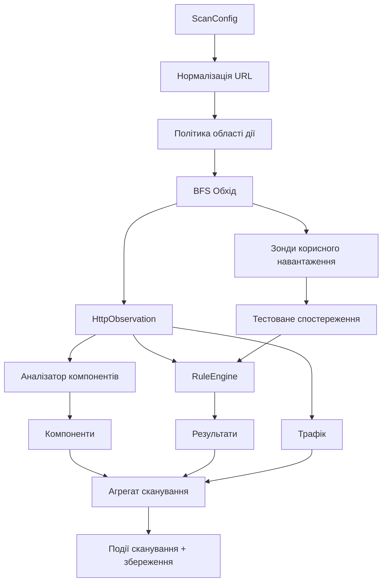

# Сканер

Сканер нормалізує цілі, забезпечує область дії (same-host або same-domain), обходить сторінки за допомогою BFS, збирає посилання та форми, ідентифікує параметри запитів, надсилає обмежені безпечні зонди корисного навантаження та генерує події для TUI.

Профілі налаштовують обсяг запитів та типи перевірок. Safe Scan є значенням за замовчуванням. Сканер не використовує брутфорс, не видаляє дані, не виконує команди та не намагається здійснити пост-виявлення експлуатацію.

## Потік виконання сканера

## Безпека та область дії

- Підтримуються лише цілі `http/https`.
- Політика області дії:
	- `same_host` (за замовчуванням): тільки той самий хост.
	- `same_domain`: той самий реєстрований домен.
	- `custom`: глоб-шаблони включення/виключення.
- Кроулер ігнорує URL-адреси, що виходять за межі області дії.
- Перевірки не виконують руйнівних дій.

## Поведінка обходу (Crawl)

- Стратегія: пошук у ширину (BFS).
- Ліміти: `max_depth`, `max_pages`.
- Джерела URL:
	- початкова ціль,
	- HTML-посилання/активи/форми,
	- прості рядки кінцевих точок з інлайнового JavaScript.
- Відповіді з помилками (>=400) не розширюють граф посилань далі.

## Зондування корисного навантаження

- Payload-перевірки виконуються для query-параметрів і недеструктивних GET/POST форм.
- Проби форм зберігають hidden/default/select/submit значення, щоб CSRF-захищені
  тренувальні застосунки й PHP-форми доходили до потрібного handler.
- Якщо query-параметрів немає, використовується контекстний набір параметрів, наприклад
  `id`, `q`, `search`, `redirect`, `url`, `file`.
- Базові поля зберігаються для кожної перевірки (`baseline_status_code`, `baseline_size`).
- Застосовується обмеження швидкості: пауза $1 / rate_limit$ секунд між перевірками.

## Профілі

Профілі - це збережені пресети сканування з конфігурації. Назви профілів є
користувацькими мітками, а не фіксованим enum, і scanner не перемикає поведінку за
іменем профілю під час виконання.

Перевірки корисного навантаження використовують стандартний безпечний набір для
кожного профілю. Scope, rate limit, ліміти сторінок, вибір правил і remote feeds
беруться з вибраного збереженого профілю.

## Події сканування (для TUI)

`ScannerEngine.run_events` генерує події:

- `started`: сканування розпочато.
- `page`: оброблено сторінку кроулера.
- `check`: оброблено зонд корисного навантаження.
- `completed`: фінальний статус.

Кожна подія містить поточний знімок `scan`.

## Пауза/Відновлення/Зупинка

- `pause()`: тимчасово призупиняє прогрес без втрати стану.
- `resume()`: відновлює цикл сканування.
- `stop()`: коректно зупиняє сканування зі статусом `stopped`.

## Виявлення компонентів

Джерела компонентів:
- HTTP-заголовки (`Server`, `X-Powered-By`).
- HTML (`meta generator`, евристика заголовка).
- JS-активи (шаблони бібліотек).
- YAML-відбитки (`rules/fingerprints/*`).
