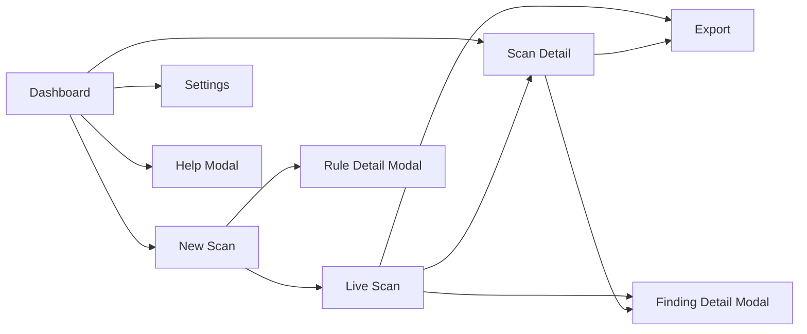
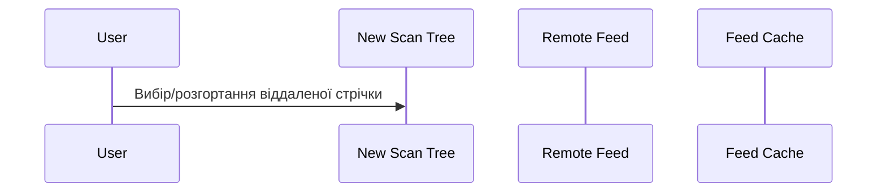

# TUI

Текстовий інтерфейс включає Панель керування (Dashboard), Нове сканування (New Scan), Живе сканування (Live Scan), Деталі сканування (Scan Detail) та Налаштування (Settings).

Робочий процес стрічки правил в UI:
- додайте URL віддалених стрічок у налаштуваннях,
- налаштуйте вибір правил для конкретного сканування на вкладці `Selected Rules` в Новому скануванні,
- перегляньте описи правил через контекстну дію в дереві правил,
- віддалені стрічки завантажуються за запитом і використовують кеш віддалених стрічок.

## Карта екранів

## Глобальна навігація

Основні прив'язки:

- `q`: Вихід
- `d`: Панель керування (Dashboard)
- `n`: Нове сканування (New Scan)
- `s`: Налаштування (Settings)
- `?`: Допомога

Метадані гарячих клавіш також включають: `f`, `r`, `/`, `e` (використовуються для підказок допомоги/UX).

## Панель керування (Dashboard)

- Показує нещодавні сканування з SQLite.
- Стовпці таблиці: `ID`, `Ціль`, `Профіль`, `Статус`, `Результати`.
- Автоматично оновлює список.
- Навігація: Нове сканування, Налаштування, Деталі сканування.

## Нове сканування (New Scan)

Вкладки:
- `Target`: URL + профіль.
- `Settings`: `rate_limit`, `max_depth`, `max_pages`.
- `Selected Rules`: дерево локальних та віддалених правил.

Особливості:
- завантаження віддалених стрічок за запитом (при виборі/розгортанні),
- прапорці на рівнях групи/джерела/реєстру/категорії/правила,
- контекстна дія для відкриття деталей правила,
- збереження та видалення профілів сканування.

## Живе сканування (Live Scan)

- Запускає виконання сканування та підписується на `ScanEvent`.
- Прогрес та поточний URL оновлюються з подій.
- Таблиця результатів підтримує сортування за стовпцями.
- Керування в реальному часі: `Пауза`, `Відновлення`, `Зупинка`.
- Експорти в HTML/JSON/Markdown стають доступними після завершення.

## Деталі сканування (Scan Detail)

- Вкладки:
  - `Findings`: таблиця результатів.
  - `Scan Settings`: збережена `metadata.config`.
- Експорт доступний для фінальних статусів (`completed|stopped`).
- Відкриває модальне вікно деталей для кожного результату.

## Налаштування (Settings)

Вкладки:
- `General`: шлях до БД, каталог звітів, формат експорту, тема HTML.
- `Scanner`: ліміти за замовчуванням.
- `Rules`: шляхи до правил, каталог кешу віддалених стрічок, віддалені стрічки.

Збереження налаштувань записує `vulnscope.yaml` та оновлює стан контролера.

## UX віддалених стрічок

